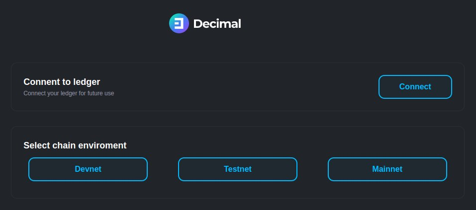

# ledger-cosmos-js

[](https://opensource.org/licenses/Apache-2.0)

This package provides a basic client library to communicate with a Decimal App running in a Ledger Nano S/X

This repo also includes a simple Vue example for U2F and WebUSB.



# Methods for ledger Nano

### Serialize human readable part of  Bech32 (HRP).

```js
import DecimalApp from "./src";
import TransportWebUSB from "@ledgerhq/hw-transport-webusb";

const transport = await TransportWebUSB.create();
const _decimal = new DecimalApp(transport);

const serializehrp = _decimal.serializeHRP('dx');
```

### Get Bech32 from PK

```js
import DecimalApp from "./src";
import TransportWebUSB from "@ledgerhq/hw-transport-webusb";

const transport = await TransportWebUSB.create();
const _decimal = new DecimalApp(transport);

const bech32 = _decimal.getBech32FromPK('dx', pk);
```

### Serialize derivation path

```js
import DecimalApp from "./src";
import TransportWebUSB from "@ledgerhq/hw-transport-webusb";

const transport = await TransportWebUSB.create();
const _decimal = new DecimalApp(transport);

const path = [44, 60, 0, 0, 0];

const serializePath = await _decimal.serializePath('dx', path);
```

### Sign get Chunks

```js
import DecimalApp from "./src";
import TransportWebUSB from "@ledgerhq/hw-transport-webusb";

const transport = await TransportWebUSB.create();
const _decimal = new DecimalApp(transport);

const path = [44, 60, 0, 0, 0];

const signedChunks = await _decimal.signGetChunks(path, messageVariable);
```

### Get app version

```js
import DecimalApp from "./src";
import TransportWebUSB from "@ledgerhq/hw-transport-webusb";

const transport = await TransportWebUSB.create();
const _decimal = new DecimalApp(transport);

const version = await _decimal.getVersion();
```

### Get app info

```js
import DecimalApp from "./src";
import TransportWebUSB from "@ledgerhq/hw-transport-webusb";

const transport = await TransportWebUSB.create();
const _decimal = new DecimalApp(transport);

const appInfo = await _decimal.appInfo();
```

### Get device info

```js
import DecimalApp from "./src";
import TransportWebUSB from "@ledgerhq/hw-transport-webusb";

const transport = await TransportWebUSB.create();
const _decimal = new DecimalApp(transport);

const deviceInfo = await _decimal.deviceInfo();
```

### Get public key 

```js
import DecimalApp from "./src";
import TransportWebUSB from "@ledgerhq/hw-transport-webusb";

const transport = await TransportWebUSB.create();
const _decimal = new DecimalApp(transport);

const path = [44, 60, 0, 0, 0];

const publicKey = await _decimal.publicKey(path);
```

### Get address and public key

```js
import DecimalApp from "./src";
import TransportWebUSB from "@ledgerhq/hw-transport-webusb";

const transport = await TransportWebUSB.create();
const _decimal = new DecimalApp(transport);

const path = [44, 60, 0, 0, 0];

const wallet = await _decimal.getAddressAndPubKey(path, 'dx');
```

### Sign send Chunk

```js
import DecimalApp from "./src";
import TransportWebUSB from "@ledgerhq/hw-transport-webusb";

const transport = await TransportWebUSB.create();
const _decimal = new DecimalApp(transport);

const res = await _decimal.signSendChunk(chunkIdx, chunkNum, chunk);
```


### Sing transaction

```js
import DecimalApp from "./src";
import TransportWebUSB from "@ledgerhq/hw-transport-webusb";

const transport = await TransportWebUSB.create();
const _decimal = new DecimalApp(transport);

const path = [44, 60, 0, 0, 0];

const res = await _decimal.sign(path, unsignedTx);
```
###
